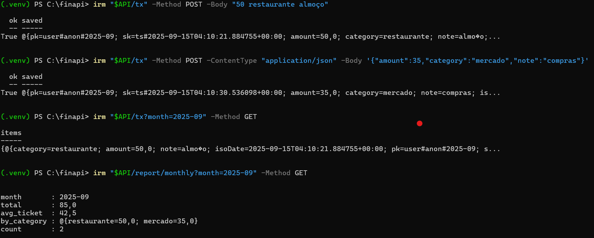
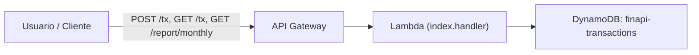
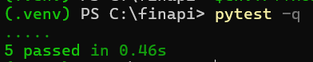

# FinAPI – Controle de Finanças Pessoais

## Descrição do problema
Muitas pessoas registram seus gastos de forma manual (planilhas, cadernos ou anotações soltas no celular).  
Isso dificulta o acompanhamento mensal, o cálculo de ticket médio e a visualização de onde o dinheiro realmente está sendo gasto.  
A ideia surgiu para simplificar esse processo: bastar enviar um texto simples como **"50 restaurante almoço"** e o sistema já organiza automaticamente no banco de dados.

## Solução
- **Infraestrutura**: AWS CDK em Python para orquestrar recursos.  
- **Backend**: AWS Lambda (Python 3.11) processa as requisições.  
- **API**: Amazon API Gateway expõe endpoints `/tx` (criar/listar transações) e `/report/monthly` (resumo mensal).  
- **Banco de dados**: Amazon DynamoDB armazena transações de forma escalável (pk=usuário+mês, sk=timestamp).  
- **Implantação**: `cdk deploy` com IaC, usando tabela, Lambda e API Gateway em **sa-east-1**.  
- **Testes**: `pytest` valida parsing de texto e criação de transações.  
- **Automação**: prompts gerados com **Amazon Q Developer**, que ajudou a montar a estrutura do projeto e código inicial.

## Estrutura

- **API Gateway**: Endpoints REST
- **Lambda**: Python 3.12 para lógica de negócio
- **DynamoDB**: Tabela com pk/sk para transações

## Rotas

- `GET /tx` - Lista transações
- `POST /tx` - Cria transação
- `GET /report/monthly` - Relatório mensal

## Deploy

### 1. Instalar dependências
```bash
python -m venv .venv
.venv\Scripts\activate  # Windows
pip install -r requirements.txt
```

### 2. Bootstrap CDK (primeira vez)
```bash
cdk bootstrap aws://<account_id>/sa-east-1
```

### 3. Sintetizar template
```bash
cdk synth
```

### 4. Deploy
```bash
cdk deploy
```

### 5. Destruir recursos
```bash
cdk destroy
```

## Exemplo de uso

### Criar transação
```bash
curl -X POST https://your-api-id.execute-api.region.amazonaws.com/prod/tx \
  -H "Content-Type: application/json" \
  -d '{"amount": 100.50, "category": "mercado", "note": "compras"}'
```

### Criar transação (texto livre)
```bash
curl https://your-api-id.execute-api.region.amazonaws.com/prod/tx \
  -d "50 restaurante almoço"
```

### Listar transações transação 
```bash
curl https://your-api-id.execute-api.region.amazonaws.com/prod/tx?month=2025-09
```

### Relatório mensal
```bash
curl https://your-api-id.execute-api.region.amazonaws.com/prod/tx?month=2025-09
```

## FinAPI - Etapa 1

### Screenshot


### Prompts usados no Amazon Q Developer
- "Crie um projeto AWS CDK em Python com API Gateway, Lambda e DynamoDB (rotas /tx e /report/monthly)."
- "Implemente função para parsear entrada como '50 restaurante almoço'."
- "Gerar requirements.txt e passos de deploy com cdk."

## FinAPI - Etapa 2

### Arquitetura


### Testes

Para rodar os testes localmente:

```bash
python -m venv .venv
.venv\Scripts\activate   # no Windows
pip install -r requirements.txt
$env:PYTHONPATH="."
pytest -q
```

### Screenshot do teste funcionando:

