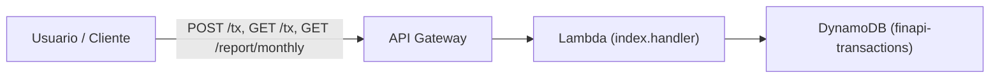

# FinAPI – Controle de Finanças Pessoais

## Sumário
- [Descrição do problema](#descrição-do-problema)
- [Solução](#solução)
- [Arquitetura](#arquitetura)
- [Estrutura do projeto](#estrutura-do-projeto)
- [Rotas](#rotas)
- [Deploy](#deploy)
- [Exemplo de uso](#exemplo-de-uso)
- [Etapa 1](#etapa-1)
- [Etapa 2](#etapa-2)
- [Etapa 3](#etapa-3)
- [Etapa 4](#etapa-4)

## Descrição do problema
Muitas pessoas registram seus gastos de forma manual (planilhas, cadernos ou anotações soltas no celular).  
Isso dificulta o acompanhamento mensal, o cálculo de ticket médio e a visualização de onde o dinheiro realmente está sendo gasto.  
A ideia surgiu para simplificar esse processo: bastar enviar um texto simples como **"50 restaurante almoço"** e o sistema já organiza automaticamente no banco de dados.

## Solução
- **Infraestrutura**: AWS CDK em Python para orquestrar recursos.  
- **Backend**: AWS Lambda (Python 3.11) processa as requisições.  
- **API**: Amazon API Gateway expõe endpoints `/tx` (criar/listar transações) e `/report/monthly` (resumo mensal).  
- **Banco de dados**: Amazon DynamoDB armazena transações de forma escalável (pk=usuário+mês, sk=timestamp).  
- **Implantação**: `cdk deploy` com IaC, usando tabela, Lambda e API Gateway em **sa-east-1**.  
- **Testes**: `pytest` valida parsing de texto e criação de transações.  
- **Automação**: prompts gerados com **Amazon Q Developer**, que ajudou a montar a estrutura do projeto e código inicial.

## Arquitetura

- **API Gateway**: Endpoints REST
- **Lambda**: Python 3.11 para lógica de negócio
- **DynamoDB**: Tabela com pk/sk para transações

## Estrutura do projeto

```text
C:\finapi
│   README.md               # documentação principal
│   requirements.txt        # dependências do projeto
│   cdk.json                # configuração do AWS CDK
│   app.py                  # entrypoint do CDK
│   amazonq.json            # integração Amazon Q Developer
│   mcp.json                # configuração do servidor MCP
│
├── finapi
│   └── finapi_stack.py     # definição da infraestrutura (DynamoDB, Lambda, API Gateway)
│
├── lambda_src
│   ├── index.py            # handler principal da Lambda
│   └── handler.py          # funções auxiliares
│
├── tests
│   ├── test_create_tx.py   # teste de criação de transações
│   └── test_parse_free_text.py # teste de parsing de entrada livre
│
└── docs
    ├── screenshot.png               # Etapa 1 – projeto rodando
    ├── tests.png                    # Etapa 2 – pytest funcionando
    ├── mcp1.png                     # Etapa 3 – MCP configuração parte 1
    ├── mcp2.png                     # Etapa 3 – MCP configuração parte 2
    ├── deploy.png                   # Etapa 3 – evidência do cdk deploy
    ├── costs.png                    # Etapa 4 – estimativa de custos
    └── architecture-ultra-low-cost.md # arquitetura de baixo custo gerada pelo Q Developer
```

## Rotas

- `GET /tx` - Lista transações
- `POST /tx` - Cria transação
- `GET /report/monthly` - Relatório mensal

## Deploy

### 1. Instalar dependências
```bash
python -m venv .venv
.venv\Scripts\activate  # Windows
pip install -r requirements.txt
```

### 2. Bootstrap CDK (primeira vez)
```bash
cdk bootstrap aws://<account_id>/sa-east-1
```

### 3. Sintetizar template
```bash
cdk synth
```

### 4. Deploy
```bash
cdk deploy
```

### 5. Destruir recursos
```bash
cdk destroy
```

## Exemplo de uso

### Criar transação
```bash
curl -X POST https://your-api-id.execute-api.region.amazonaws.com/prod/tx \
  -H "Content-Type: application/json" \
  -d '{"amount": 100.50, "category": "mercado", "note": "compras"}'
```

### Criar transação (texto livre)
```bash
curl https://your-api-id.execute-api.region.amazonaws.com/prod/tx \
  -d "50 restaurante almoço"
```

### Listar transações  
```bash
curl https://your-api-id.execute-api.region.amazonaws.com/prod/tx?month=2025-09
```

### Relatório mensal
```bash
curl https://your-api-id.execute-api.region.amazonaws.com/prod/tx?month=2025-09
```

## Etapa 1

### Screenshot do projeto funcionando:


### Prompts usados no Amazon Q Developer
- "Crie um projeto AWS CDK em Python com API Gateway, Lambda e DynamoDB (rotas /tx e /report/monthly)."
- "Implemente função para parsear entrada como '50 restaurante almoço'."
- "Gerar requirements.txt e passos de deploy com cdk."

[Veja os prompts completos aqui](docs/prompts.md)

## Etapa 2

### Arquitetura (Mermaid)



---

### Testes

#### Para rodar os testes localmente:

```bash
python -m venv .venv
.venv\Scripts\activate   # no Windows
pip install -r requirements.txt
$env:PYTHONPATH="."
pytest -q
```

#### Screenshot do teste funcionando:


## Etapa 3 

### Servidor MCP
Foi configurado o **AWS Knowledge MCP Server** no Amazon Q Developer, permitindo buscar documentação e arquiteturas oficiais da AWS direto na IDE.  
#### Screenshots capturadas durante a configuração:  
  
  

---

### Amazon Q Developer
Foram adicionados dois arquivos na **raiz do projeto** para integração com o Amazon Q Developer:

- **`mcp.json`** - define o servidor MCP utilizado (AWS Knowledge MCP Server).  
- **`amazonq.json`** - metadados do projeto (nome, linguagem, framework, comando de testes e vínculo com o MCP).  

---

### IaC para deployar na AWS
A infraestrutura é provisionada via **AWS CDK (Python)**, atendendo ao requisito de IaC.  
#### Arquivos principais:
- `app.py` – entrypoint do CDK  
- `finapi/finapi_stack.py` – definição da infraestrutura (DynamoDB, Lambda e API Gateway)  
- `cdk.json` e `requirements.txt` – configuração e dependências  

#### Comandos de deploy:
```bash
cdk bootstrap aws://<ACCOUNT_ID>/sa-east-1
cdk deploy
```

#### Screenshot do deploy:  


## Etapa 4 

A estimativa de custo foi gerada automaticamente pelo **Amazon Q Developer**.
O documento descreve uma arquitetura de **baixo custo** para o FinAPI, considerando uso de **API Gateway, AWS Lambda e DynamoDB**.

### Consulte o arquivo completo em: [docs/architecture-ultra-low-cost.md](docs/architecture-ultra-low-cost.md)

### Screenshot dos custos: 
